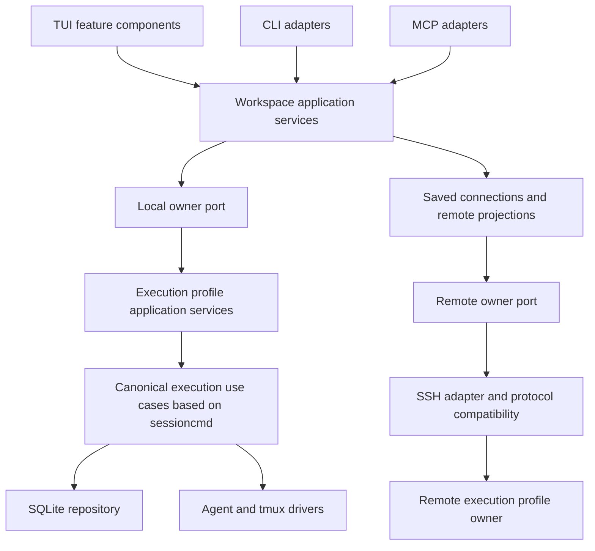

# Proposed application boundaries

This is an application-wide design proposal. The executable POC now exercises workspace coordination, cooperating owners, typed fixture operations, representative client adapters, feature state and the compatibility/transport boundary. It does not migrate all existing application behavior.

## Responsibilities

| Boundary | Responsibility | Relation to Yoan's requests |
|---|---|---|
| Presentation | Feature state, focus, key dispatch, shared UI services; updates never block | Feature UI types, smaller root Model, smaller files |
| Workspace | Saved connection definitions, local/remote inventory projections, namespaced identities, asynchronous generation checks | Replace fleet.json, maintain hierarchy and offline recovery |
| Execution profile | Authoritative session state and lifecycle/maintenance through application commands and reads | Shared sessioncmd logic and a headless owner without another TUI |
| Client and transport adapters | CLI/TUI/MCP translate requests; SSH carries owner commands; remote MCP remains device-local while local MCP may aggregate | Local aggregation, remote scope, future clients and extensions |
| Contracts and rollout | Environment/deployment identity, owner capabilities, protocol versions, writer/schema compatibility, input authority | Mixed versions, restart/replacement, future shared-session interactions |

These are responsibility boundaries, not a mandate to create five packages or five long-lived services. Extract the first boundary only when an actual caller needs it. Shared lifecycle functions belong behind owner application services; sharing code alone does not enforce a single maintenance owner.

## Gaps the POC intentionally leaves open

The POC environment ID is profile lineage, not independently verified host identity. Its lock binds only cooperating POC processes. Its revisions are synthetic; actual old CLI/TUI/MCP writers can bypass it. Production needs explicit upgrade/quiesce/isolation rules, independently verified deployment identity and connection generations, and real client/owner version tests. Schema migration compatibility must be assessed separately from wire compatibility.

Read projections should not acquire input authority. Shared viewing and independent sessions can precede same-pane control. Same-pane input needs explicit claims and fencing; neither transport sharing nor inventory ownership proves that property. Mutation retries also need idempotency and uncertain-outcome handling before real agent launch is exposed.

## Delivery order

1. Specify the owner identity/capability contract and migrate one existing inventory reader.
2. Put one existing lifecycle command behind the owner with an old-writer cutover rule.
3. Add saved connections and headless startup, keeping workspace aggregation separate from remote device scope.
4. Move UI feature state incrementally using Yoan's decomposition, preserving nonblocking updates and async generation guards.
5. Validate actual supported client/owner versions and failure recovery; add shared input only after explicit authority and fencing exist.

The architecture spans the product. The POC is a small executable argument for its hardest new boundary. Neither justifies a wholesale rewrite before shipping the current connection work.

## DDD and patterns: the application-wide decision

Use strategic DDD to distinguish workspace coordination from authoritative execution profiles. A projected remote session is a read model, not a locally mutable session entity. Use typed targets for profile/session identity; keep transport DTOs distinct from persisted domain state. A UI feature is not automatically a bounded context.

Use application services for lifecycle use cases, ports/adapters for SQLite, agent drivers, SSH and clients, and a command/query distinction for maintenance versus inventory/preview reads. Dependency injection can be plain Go constructors. Avoid a generic service locator, event-sourcing framework, generic plugin registry, or an interface per function. The shared sessioncmd layer should hold explicit use cases, not become a miscellaneous utilities package.

The two sketches are complementary in the production migration. Use a workspace service for projection, connection and scope rules; extend the existing shared `sessioncmd` seam for canonical execution behavior behind the owner. The POC's fixture use cases are disposable instruments, not a second production lifecycle implementation to maintain.

Yoan's UI decomposition is compatible with this design but orthogonal to the ownership problem. Moving poller files and reducing Model fields improves presentation maintainability; it does not establish authority, version contracts or distributed-state semantics. Conversely, this proposal does not require changing every UI component before delivering connections.

## What the expanded application-wide proof covers

The expanded vertical slice covers the following concerns using one shared application boundary. It remains insufficient as proof of every production behavior:

1. TUI-style, CLI and MCP clients consume one application API and owner-controlled fixture operations. Actual production maintenance scheduling remains a separate acceptance case.
2. A saved SSH connection adds remote projections to local workspace aggregation, while remote MCP reads remain device-local.
3. Two example domain extensions, such as a queued lifecycle action and a session metadata query, fit behind typed use cases without adding transport-specific domain branches or growing a central UI Model.
4. A connection rename preserves target identity; reconnect, replacement and cloned profiles cannot apply stale responses or misroute mutations. New clients cannot bypass an old owner's missing capabilities.
5. Deterministic domain tests and real subprocess, stdio MCP and SSH examples exercise the contracts. Actual historical binary/schema compatibility and old-writer isolation remain required before release promises.

This is an application-wide architecture POC, not a reimplementation of all 43,560 production Go lines. Its purpose is to expose whether boundaries survive representative flows and new extensions. The owner-only POC is a component of the expanded proof. See README.md for the observed results and commands that regenerate validation evidence.
