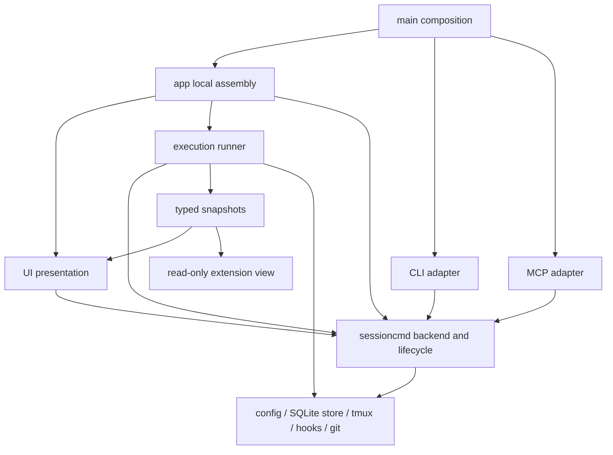

# Application architecture proposal

The maintained [architecture contract](architecture/README.md) restores the broader rationale from PR #1. The [conformance audit](architecture/roadmap-and-evidence.md) separates implemented boundaries from outstanding requirements. PR #2 is partially conformant. Help, Review, Focus, and Rail own behavior in private packages, and View reads a prepared frame. Synchronous UI effects, partial lifecycle reconciliation, remaining dialog ownership, and production compatibility remain gaps.

This branch refactors the running application against upstream `dc471a97f3ca4fdd06eb822a31e8e5119c39b997` (2026-09-30) and has since merged upstream `cf9ed0d` (2026-10-07). It changes existing production callers and moves their implementations. The earlier additive architecture POC and archive/inbox-only extraction are supporting evidence, not this deliverable.

## Current application and resulting boundaries

| Concern | Upstream main | This proposal |
| --- | --- | --- |
| Background execution | `ui/poller.go` performs delivery, mailbox processing, status writes, heartbeats, conversation capture and sampling | The actual implementation and algorithm tests live in UI-free `execution`; presentation receives typed snapshots |
| Lifecycle effects | CLI/MCP use `sessioncmd`; TUI duplicates launch, kill, revive/restart and archive ordering | `sessioncmd.Lifecycle` owns shared launch, kill, revive, restart, archive, restore and human-delete effects used by CLI, MCP and TUI |
| Resource lifetime | UI owns its open store; CLI/MCP command operations construct and close runtimes independently | `sessioncmd.Backend` explicitly opens or borrows one runtime; borrowed command operations do not close the shared store |
| Presentation state | `Model` has a large flat set of unrelated fields | Private Help, Review, Focus, and Rail models own feature state; named root groups hold remaining presentation and runtime dependencies |
| Composition | UI constructor assembles polling/tool runtime | `app` assembles local services; `main` supplies them to the UI and explicitly binds CLI/MCP session, terminal, rename and review mutations to one backend |
| Extensions | Additional consumers would need UI/store/tmux internals | A copied read projection supports observations; mutating extensions call existing canonical command ports |



This is an application-wide boundary refactor. [Help, Review, Focus, and Rail](architecture/ui-feature-packages.md) own policy behind private models, copied inputs and typed outcomes. Root composition prepares layout, geometry and the rendered frame after dispatch; View only returns the cached frame. Other dialogs remain root methods, the root message router remains substantial, and lifecycle and rail effects still block Update. The remaining ownership and effect requirements from [#646](https://github.com/YoanWai/agent-manager/issues/646) are tracked in the conformance audit.

## Relationship to the earlier POC

[PR #1](https://github.com/ribeirojose/agent-manager/pull/1) remains the record of the standalone owner protocol, saved-workspace, SSH transport and synthetic version experiments. This branch carries its production archive/inbox extraction into the application refactor; it does not copy those experimental implementations into the running application.

| Earlier experiment | This application refactor |
| --- | --- |
| Archive command owner and inbox retention ports | Retained in `sessioncmd`; maintenance runs through `execution` |
| Standalone owner protocol and synthetic compatibility revisions | Supporting evidence in PR #1; production transport and historical-writer cutover remain future work |
| Saved connections, remote projections and SSH owner adapter | Supporting evidence in PR #1; no production connection catalog or remote adapter is introduced here |
| Fixture extensions and sample feature components | Replaced with examples using real application commands and execution projections; full feature-handler extraction remains incremental |

Closing PR #1 as superseded means PR #2 is the production refactor to review. It does not mean every experiment or future feature in PR #1 has shipped.

## Design alternatives and synthesis

Two structurally different shapes were compared.

1. Keep the existing substantive `sessioncmd` use cases, bind their dependencies, consolidate lifecycle effects, extract execution, and make presentation state explicit.
2. Replace direct application calls with a remote-first command/event bus covering sessions, terminals, coordination, review, execution and lifecycle. Every frontend would become a protocol client of a dedicated owner process.

The first shape is implemented here. The repository already has substantive application code shared by CLI and MCP; introducing another application facade would add pass-through layers. The second shape would require production protocol semantics, deployment, uncertain outcomes and historical-writer fencing at the same time as the refactor. It becomes appropriate when that process cutover is implemented and verified, rather than as a package organization claim.

The design exploration used the available native design lane and source-grounding reviewers. The configured external design providers were unavailable; this is reduced provider diversity, not a completed four-provider consensus.

## Domain modeling and patterns

The useful domain boundaries are session lifecycle, execution/readiness, coordination, and workspace presentation. Existing transactional task claims, inbox claims and reservation batches remain with their established store/use-case implementations. An aggregate hierarchy or repository interface for every table would add abstraction without removing the difficult policies.

The patterns used are explicit dependency composition, application services, frontend adapters and read projections. A `Backend` has one local resource binding. A `Lifecycle` borrows resources and owns ordered effects. An execution runner owns mutable polling state. Presentation groups own their visible state. Extensions receive value summaries or a narrow command interface, not a pointer to the root model.

Human and session actors are deliberately different. Session archive preserves a live pane and refuses self-archive. Human selection archive snapshots before destructive effects; immediate membership reconciliation after partial failure remains an explicit gap. Archive and delete restore watching of a surviving selected session before returning from failed work. Shared machinery must not erase that policy distinction.

Launch label failure remains separately represented because the human UI reports it while session commands treat it as cosmetic. A label failure after relaunch now remains a warning while status and acknowledgement updates finish. Previously the TUI returned before those updates. Failed row creation also removes the hook file for every frontend, extending the cleanup previously used by the TUI to CLI and MCP launches. If pane rollback fails, the error retains the persistence failure and identifies the surviving pane. Restore reports label warnings after reconciling its completed effects.

Batch archive, restore and delete return completed effects when a later step fails. Delete reconciles completed removals. Archive and restore perform some local reconciliation, but their error paths return before updating visible archive membership; a later poll must refresh those flags. Complete immediate reconciliation remains a UI conformance gap. Existing snapshot preflight, child-before-parent deletion, and worktree preservation policies remain in the shared lifecycle implementation.

## Execution lifetime and local coordination

`Runner.Run(ctx)` keeps the latest result unless an unread error is pending. That error result takes priority until its subscriber observes it. Maintenance continues when the UI stops draining observations, including during tmux attach. Cancellation stops new passes and waits for outstanding conversation capture before closing the result channel. The composition root drains execution before closing its store.

Cancellation is checked between existing driver calls. Existing tmux subprocess calls do not have a context deadline, so there is no claimed fixed wall-clock shutdown bound.

Reflow and fork-key coordination remain honest in-process runtime APIs. Closures used for local resizing are not a remote transport contract. `ClaimPoller` still provides the existing socket-based ownership policy; it is not process-instance fencing.

## Client compatibility and future owner rollout

| Surface | Evidence in this branch | Remaining boundary |
| --- | --- | --- |
| CLI | Existing names, arguments, vocabulary and output shapes remain; real main binds canonical commands to its explicit backend | Historical binary execution across mixed releases is separate evidence |
| MCP | Existing SDK/default tests plus explicit 2024-11-05, 2025-03-26, 2025-06-18 and 2025-11-25 protocol-mode tests; text fallback, malformed mutation refusal and service errors | These use the current pinned SDK in older modes, not historical client binaries |
| Local service failures | A supplied command service reports its failure; callers do not replace it with a newly opened local service | A network adapter with environment/owner-instance binding is not shipped here |
| SQLite and execution ownership | Existing schema and socket ownership behavior are preserved | Old-writer exclusion, owner-instance fencing and safe in-flight cutover still need a production rollout |
| Multiple devices/workspaces | Explicit profile and tmux driver binding can be composed without the UI constructing execution | A connection catalog, remote transport, capability negotiation and stale projection policy remain separate implementation work |

For a remote implementation, negotiation must use protocol versions and capabilities rather than binary version strings. Reads may omit unsupported optional observations; writes must refuse unsupported semantics before dispatch. A client must capture device/profile and owner identity, the owner must validate that binding at the effect boundary, and an uncertain response must not trigger a local fallback or automatic replay. Adding a transport does not prove that an older binary cannot keep writing SQLite directly.

## Runnable extension and headless examples

`examples/extensions` contains a delivery backlog observer and an explicit archive action. The archive example uses the same canonical command layer as current frontends, refuses invalid callers without state changes, and observes successful archival in the next projection. No plugin registry or duplicate domain implementation is introduced.

`examples/headless` runs the production composition and execution loop without importing UI or Bubble Tea. Supply both a disposable profile and a named tmux server:

```sh
go run ./examples/headless --profile /tmp/am-demo-profile --socket am-poc-demo
```

Use an isolated `TMUX_TMPDIR` for experiments. This example proves reusable headless execution, not exclusive daemon cutover or remote-client compatibility.

## Validation

The clean upstream full race suite passes in an isolated shell environment. Use an empty `ZDOTDIR`, unset `TMUX`, and a separate short `TMUX_TMPDIR`; the local user's startup script otherwise prints unrelated errors into fixture panes.

The proposal includes execution extraction, backend composition, presentation state changes and shared TUI lifecycle effects. The pull request records validation for the published head. Remote ownership and historical client cutover remain outside this refactor.
