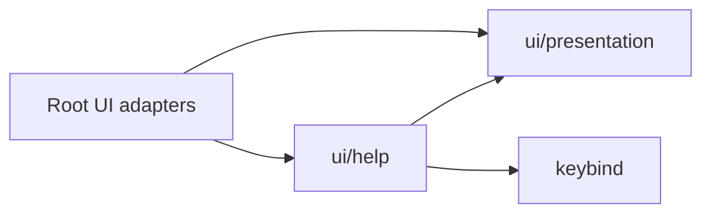

# Help feature package

Help is the first UI feature extracted into a separate Go package. It owns its catalog, review or global scope, query editing, scrolling state, input outcomes, and styled body content. Root `internal/ui` owns navigation, command scheduling, generic dialog chrome, final frame geometry, and IME cursor publication.

## Dependency boundary

`ui/help` imports neither the root UI package nor application runtime packages. `ui/presentation` contains only the three text operations shared by Help and existing root consumers: padding, section dividers, and a visible window with overflow markers. Theme state stays in root UI. Styles, bindings, glyphs, and the cursor marker enter Help as current value inputs.

The dependency check runs as `go run ./tools/architecture/check-ui-boundaries`. Its integration test also runs in the normal repository suite. It examines the transitive Go dependency graph and permits only Help, presentation, and keybind among this repository's packages. This protects against adding a root model, store, tmux driver, or broad runtime dependency to the feature.

## Root adapter flow

Root constructs `help.New(scope)` when opening the feature and remembers its own return mode. On an input or view event, root supplies current bindings, theme styles, available text width, and presentation symbols. `State.Content` returns the title, optional search header, full body lines, hint pairs, and current scroll offset.

Root derives the viewport from terminal height, the wrapped hint rows, search-header rows, and status rows. `State.Update` consumes a key and this prepared viewport, mutates only feature state, and returns Stay, Close, or Quit. Root interprets the action. In particular, it restores review mode before scheduling the review loader tick.

For painting, root applies the shared presentation window to the content, then uses the existing dialog renderer. This extraction owns Help's body rendering, not the whole terminal frame. The existing final frame still clamps geometry and consumes the IME marker.

Theme and binding values are supplied on every adapter call. They are not cached when Help opens. Input dispatch and the existing consumption of mouse events remain unchanged.

## Tests and remaining work

Catalog, state, search, scroll, and content tests live beside the feature source. They construct no root Model, SQLite fixture, or tmux server. An uncached local race run reports Help at 1.382 seconds. Its compiled test binary also passes with external commands unavailable. These measurements describe the extracted package, not a whole-suite speedup. Root keeps adapter navigation tests, normalized full-frame goldens, and final IME publication tests. Root's existing package TestMain still starts its tmux anchor.

Review, Focus and Rail are now private feature packages; View reads a cached frame and the [ordered effect lane](ui-effects.md) covers lifecycle and Rail persistence. The committed process harness runs in CI. The [roadmap](roadmap-and-evidence.md) retains remaining synchronous paths and the broader process/platform/client matrix.
